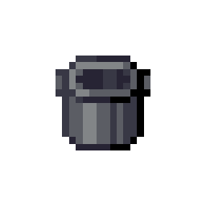
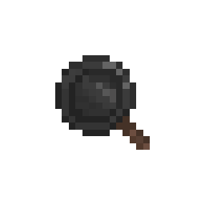
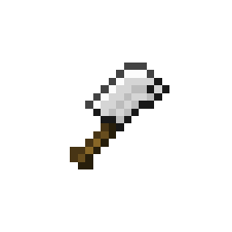
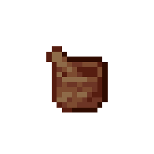

# Utensils

Croptopia comes with a set of utensils for making various foods. The utensils have no durability so can be used infinitely.

| Name              | Item                                                                     |
|-------------------|--------------------------------------------------------------------------|
| Cooking Pot       |        |
| Food Press        |            |
| Frying Pan        |         |
| Knife             |              |
| Mortar and Pestle |  |
