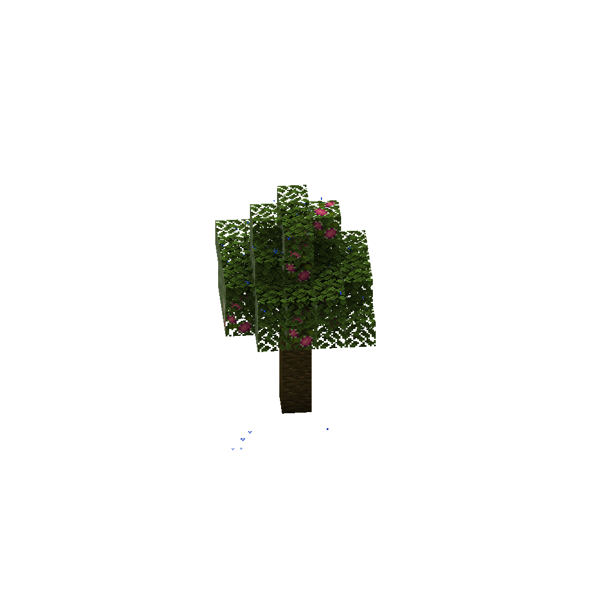
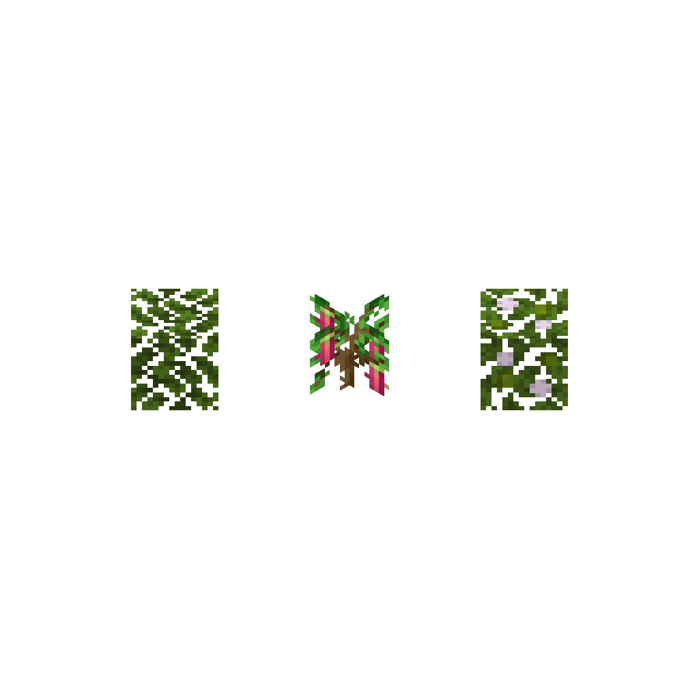

# Trees

Trees in Croptopia closely mimic what can be found in vanilla.

Below is what a Dragon Fruit tree looks like.

If you want to replicate fruit leaves on your own trees, you will need a matching leaf block plus a sapling, and
right clicking the sapling to the leaf block will turn it into a fruit crop.

The leaves must match the original tree, however. Right-clicking with a dragon fruit sapling on birch leaves will not work.

