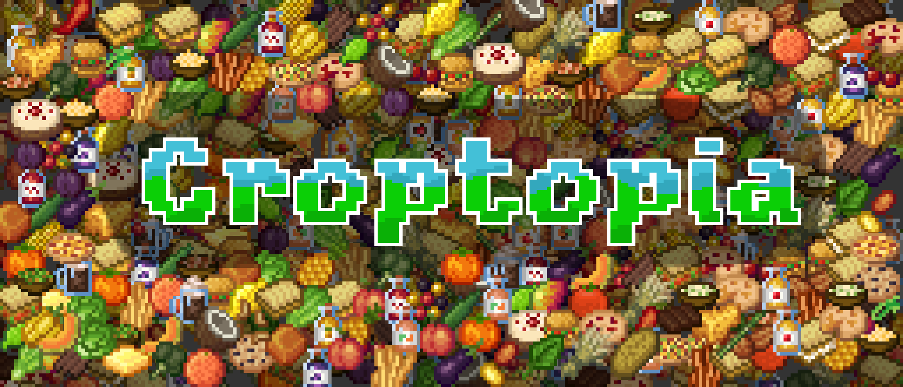
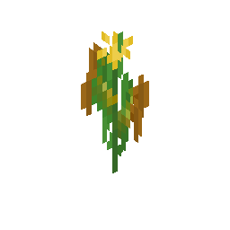
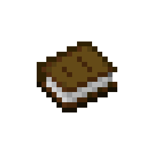
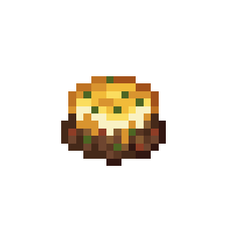

# Croptopia

The official wiki for the Croptopia mod.

Croptopia is a minecraft mod for the Forge and Fabric modloaders that adds

* 58 ground crops.
* 26 tree crops.
* over 250 foods to craft and eat.

### Download

Croptopia can currently be downloaded on Curseforge, [here](https://www.curseforge.com/minecraft/mc-mods/croptopia)

### Features (Quick Access)

| 
Crops
                                 | 
Configuration
                          | 
Ingredients
                         |
|--------------------------------------------------------|---------------------------------------------------------|------------------------------------------------------|
|      |       |  |
| 
**Food**
                              | 
**Utensils**
                           | 
|  |  |

